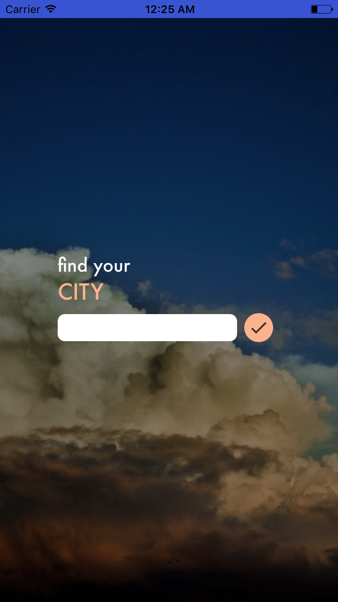

# Twelper

A mobile app that helps new visitors to cities discover exciting destinations and plan the best trip possible.

Built using Node.js and React Native technologies, along with leveraging the [Yelp](https://www.yelp.com/developers/documentation/v3), [Uber](https://developer.uber.com/) and [Unsplash](https://source.unsplash.com/) APIs.

## Screenshots

## Build instructions

1. Clone this repository.
2. Follow the instructions below to instantiate the server and build the React Native application.

### Node.js Server

1. `cd` into server directory and run `npm install`
2. Rename `server/uberSecret-template.js` to `server/uberSecret.js` and `server/yelpSecret-template.js` to `server/yelpSecret.js`
3. Retrieve [Uber API](https://developer.uber.com/) credentials and replace the values in `server/uberSecret.js` accordingly
4. Retrieve [Yelp API v3](https://www.yelp.com/developers/documentation/v3) credentials and replace the values in `server/yelpSecret.js` accordingly
5. Start the server with `npm start`

### React Native application

1. Follow the [React Native installation instructions](https://facebook.github.io/react-native/docs/getting-started.html)
2. `cd` into react-native directory and run `npm install`
3. Rename `react-native/env-template.js` to `react-native/env.js`
4. Retrieve [Uber API](https://developer.uber.com/) credentials and replace the values in `react-native/env.js` accordingly

    If running the server locally, replace `api` in `react-native/env.js` with `http://localhost:8000`

    Otherwise, replace `api` in `react-native/env.js` with the URL to where your server can be found.

5. Run the following commands from within the `react-native` directory
6. Debug the app on iOS with `react-native run-ios`
7. When ready to build a release build, run the command `react-native run-ios --configuration Release` or follow the directions provided by the React Native docs [here](https://facebook.github.io/react-native/docs/running-on-device.html)

## Devpost Submission

This hack was created for [QHacks 2017](http://qhacks.io/) and was submitted to Devpost [here](https://devpost.com/software/twelper/)

### Inspiration

One of the members of our team came up with it on the bus on the way to the hackathon. She actually came up with a bunch of different ideas and we voted as a team (over the course of about 3 hours) for which one we were eventually going to work on!

### What it does

Twelper leverages the Yelp and Uber APIs to suggest popular destinations for the user to visit in a new city, and then provides them with a convenient way to request trips between each of their destinations. Using Twelper, a traveller can plan a day filled with fun activities.

### How we built it

The backend for the application is written in Node.JS. When a request hits our endpoint from the frontend, we make a series of requests to the Yelp and Uber APIs to retrieve a list of destinations in the user's area, and the travel times and costs between each of these destinations. We then employ an algorithm of humble heuristics to create a convenient travel itinerary from one stop to the next.

The frontend of the application is written with React Native and was primarily developed using iOS, but will be easily portable to Android as well. The front end gathers a number of details about the user, including their location, where they're visiting and how many things they're interested in doing that day. It sends that information to our backend and then displays a list of all the destinations we've suggested for the user, as well as convenient buttons for the user to request Uber rides in between each stop.

### Challenges we ran into

Learning a new API is always hard and the sheer vastness of Yelp's APIs can make it an even more daunting task. Discovering what calls we can make and what we can make them with was a constant learning process throughout the weekend, as we refined the data we were requesting from Yelp. Similarly with Uber, taking their APIs and finding optimal travel paths across the city, as well as learning about using deep linking to conveniently open the app for the user.
